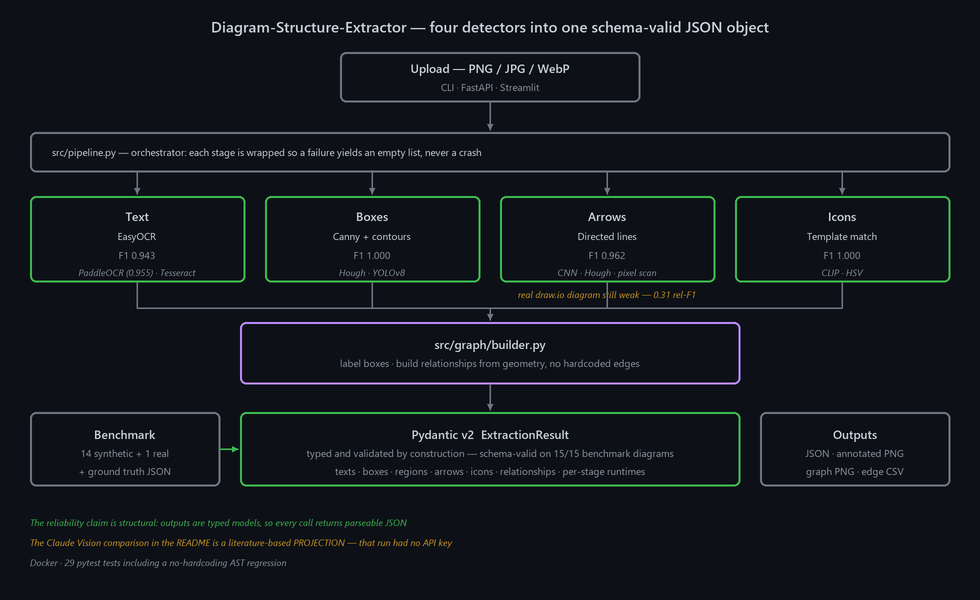

> 🔗 **Live API:** https://iambatman07-diagram-structure-extractor.hf.space — try `/health` and `/extract` · [HF Space](https://huggingface.co/spaces/IamBatman07/Diagram-Structure-Extractor)

# Diagram-Structure-Extractor

Give it a picture of an architecture diagram and it returns the diagram's structure as JSON: every text label, every box, every arrow, every icon, and which components connect to which. Four independent computer-vision detectors run over the image, and a graph builder turns their output into relationships from geometry alone — no hardcoded edges.

The reliability claim is structural rather than statistical. Output is a Pydantic v2 model, validated by construction, and each detector stage is wrapped so a failure produces an empty list instead of a crash. That is what makes the JSON parseable on **every** call, which is what a downstream RAG indexer or knowledge-graph builder actually needs.

---

## Architecture



---

## Measured results

Fifteen diagrams, each with a hand-written answer key: 14 synthetic renders of public reference architectures (`data/eval/generate_diagrams.py`) and one real draw.io export (`search_interview_test.png`).

**The synthetic renders were redrawn on 2026-10-05.** Every arrow used to be aimed from box centre to box centre, stopping about 30 px short of each centre, so the horizontal and near-horizontal ones (15 of 52) ran straight through both labels, which made OCR misread them ("Mesrage Broker", "Lainbda Fune"). Arrows now run edge to edge, as in real diagrams. Two layout bugs went with it: diagram_01's App Server box ran off the canvas, and in diagram_11 the Orchestrator → Saga Log arrow passed through Payment Step. The component and edge answer key (`ground_truth.json`) did not change; the pixel box key (`ground_truth_boxes.json`) was re-derived from the new renders (diagram_11's Saga Log moved, diagram_01 is wider). Scores on the old and new renders are not comparable: the same code that scored 0.636 relationship F1 on the old renders scores 0.924 on the new ones.

### Detector bake-off

| Stage | Champion | Precision | Recall | F1 | Runners-up (F1) |
|---|---|---:|---:|---:|---|
| Text | PaddleOCR | 0.915 | 1.000 | **0.955** | EasyOCR 0.943 |
| Boxes | Canny + contours | 1.000 | 1.000 | **1.000** | Hough 0.359, YOLOv8 0.000 |
| Arrows | directed lines | 0.944 | 0.981 | **0.962** | CNN-verified Hough 0.565, plain Hough 0.475, pixel scan 0.226 |
| Icons | Template matching | 1.000 | 1.000 | **1.000** | CLIP 0.667, HSV 0.000 |

The arrow row scores raw detector output as unordered pairs against the answer-key boxes (`ground_truth_boxes.json`, projected from the generator's box coordinates), pooled over the 14 synthetic diagrams: an endpoint must lie within 25 px of a box border, and a connector found twice counts as a false positive. The "Arrow stage alone" row below runs the same detections through the graph builder instead, which merges duplicates, snaps endpoints within 160 px, projects unmatched ones along the line and scores direction per diagram; that is why it reads 1.000 while this row reads 0.962 (three duplicate segments in diagram_04/09, one diagram_10 endpoint 46 px from its box). **PaddleOCR now edges EasyOCR by 0.012 F1, but the pipeline still defaults to EasyOCR.** Tesseract is wired in but was not scored (no native binary on the benchmark machine). Source: [`results/phase2_leaderboard.csv`](results/phase2_leaderboard.csv)

### Arrows: the directed-lines detector

On the original renders the old Hough detector dropped every diagonal segment and fused a row of chained arrows A → B → C into one A → C line. It also never looks for the arrowhead: it reports every line left to right or top to bottom, which happens to be right on this benchmark only because every horizontal or vertical arrow in it points right or down. `src/arrow_detection/directed_lines_detector.py` handles all three: any-angle Hough with dash-gap bridging, a collinear merge, a split wherever an arrowhead sits mid-line, and orientation from the end that carries the solid arrowhead.

Each column is that detector with its own default gate setting (old: gate on, new: gate off).

| Relationships macro-F1 | Hough lines (old) | Directed lines (new) |
|---|---:|---:|
| Full pipeline, 15 diagrams | 0.422 | **0.924** |
| Full pipeline, 14 synthetic diagrams | 0.428 | **0.968** |
| Arrow stage alone (ground-truth boxes, 14 diagrams) | 0.530 | **1.000** |
| `search_interview_test.png` (the one real-world diagram) | **0.333** | 0.308 |

The third row feeds the answer-key boxes from `ground_truth_boxes.json` to the graph builder, isolating the arrow stage from OCR and box errors. On the synthetic diagrams the remaining full-pipeline misses are one OCR misread that costs an edge ("53 Source" for "S3 Source") and one false edge in diagram_10. **The real-world diagram is still slightly worse:** each detector finds 2 of its 8 edges, but only Indices → ELSER Model is common to both. The old detector also gets Server Website → Plant An App; the new one outputs that edge reversed, so it counts as one of its 3 false positives (the old detector has 2), and finds Elastic Connector → Indices instead. It is a draw.io export with small filled arrowheads (two connectors are double-headed) that the erosion behind the solid-ink orientation check almost wipes out, and its connectors run through nested containers the box stage reports as boxes. Source: [`results/arrow_detector_comparison.csv`](results/arrow_detector_comparison.csv) (`python benchmark_arrow_detectors.py`)

### Stage ablation — and the gate that no longer earns its place

| Stage | Components F1 | Relationships F1 | Schema-valid | Δ relationships |
|---|---:|---:|---:|---:|
| A — text only | 0.958 | 0.000 | 1.000 | — |
| B — + boxes | 0.962 | 0.000 | 1.000 | 0.000 |
| C — + arrows | 0.962 | **0.924** | 1.000 | **+0.924** |
| D — + ray intersection | 0.962 | 0.924 | 1.000 | 0.000 |
| E — + outside-box gate (opt-in) | 0.962 | 0.843 | 1.000 | **−0.082** |
| F — full pipeline (gate off) | 0.962 | 0.924 | 1.000 | +0.082 |

Two things worth stating plainly:

- **The outside-box gate is off by default.** It was calibrated for the old Hough detector's box-border artifacts. With the directed-lines detector it costs −0.082 relationship F1 on this benchmark and drops the real-world diagram from 0.308 to 0.167. Border segments map both endpoints to the same box and are discarded without it. It stays available as `outside_box_gate=true` / `--gate`.
- **Schema validity is 1.000 at every single stage.** That is the property the design is actually optimising for, and it never moves. It holds by construction (every result is a Pydantic model); the ablation records it rather than re-validating each output.

Source: [`results/ablation.csv`](results/ablation.csv)

### Comparison against a vision model

| Metric | Day-1 pipeline (measured) | Claude Vision (**projection**) |
|---|---:|---:|
| Schema-valid JSON rate | **1.000** | 0.130 |
| Components macro-F1 | 0.763 | n/a |
| Arrows macro-F1 | 0.172 | n/a |
| Avg runtime per diagram | 15.37 s | **2.20 s** |
| Cost per diagram | **$0.0000** | $0.0532 |

> **The Claude Vision column was never measured.** The benchmark run had no `ANTHROPIC_API_KEY`, so that column is a literature-based **projection**, and `results/frontier_comparison.csv` labels it `(PROJECTION)` in the header. The harness at `benchmark_claude_vision.py` is live-ready and will replace it with real numbers when re-run with credentials. A live run would score Claude on the redrawn 2026-10-05 renders while the Day-1 column stays on the original ones, so the two columns would not be like-for-like.
>
> **The Day-1 pipeline column (`DiagraMine (measured)` in the CSV) is a frozen Day-1 measurement** (`results/baseline_metrics.json`, 2026-05-25): the original monolithic pipeline on the original benchmark renders. It is not the current pipeline — see the ablation above for that — and the harness that produced it no longer runs.
>
> The vision model is also genuinely faster — 2.20 s against 15.37 s — and that row is a loss.

Source: [`results/frontier_comparison.csv`](results/frontier_comparison.csv)

---

## How it works

1. **Upload** a PNG, JPG or WebP through the CLI, the FastAPI endpoint or the Streamlit demo.
2. **`src/pipeline.py`** selects detectors from a `PipelineConfig` and wraps each stage so failure degrades to an empty list — this is what guarantees schema-valid output.
3. **Four detectors run**: EasyOCR for text, Canny + contours for boxes, directed lines for arrows, template matching for icons. Any stage can be set to `none` to skip it.
4. **`src/graph/builder.py`** labels boxes with their text and derives relationships from geometry — there are no hardcoded edges, and a pytest AST regression fails the build if any reappear.
5. **Emit** a typed `ExtractionResult`, plus an annotated PNG, a `networkx` graph render and a flat edge CSV.

## Infrastructure

| Layer | Technology |
|---|---|
| Text | EasyOCR (default) · PaddleOCR (bake-off champion) · Tesseract (optional native binary) |
| Boxes | OpenCV Canny + contours · Hough · YOLOv8 |
| Arrows | directed lines (any-angle Hough + arrowhead orientation) · Hough lines + thinning · CNN verifier |
| Icons | template matching · CLIP · HSV |
| Graph | networkx (kamada-kawai layout) |
| Schema | Pydantic v2 |
| API | FastAPI · Streamlit demo |
| Packaging | Docker |
| Tests | 29 pytest, including a no-hardcoding AST regression |

---

## Quick start

```bash
# 1) Local install
python -m venv .venv && source .venv/bin/activate   # Windows: .venv\Scripts\activate
pip install -r requirements.txt

# 2) Run on the bundled test diagram (or any path)
python diagram_analysis.py                                   # uses search_interview_test.png
python diagram_analysis.py path/to/your/diagram.png

# 3) Modular orchestrator with detector overrides
python -m src.pipeline data/eval/diagrams_15/diagram_02.png \
       --out /tmp/out --text paddleocr --arrow hough_lines

# 4) FastAPI service
uvicorn src.api:app --port 8000
curl -F "file=@diagram.png" http://localhost:8000/extract | jq .

# 5) Streamlit demo
streamlit run app.py

# 6) Tests
pytest tests/ -q

# 7) Benchmarks
python data/eval/generate_diagrams.py          # re-render diagram_01..14 + ground_truth.json
python data/eval/derive_ground_truth_boxes.py  # pixel box answer key
python benchmark_ablation.py
python benchmark_arrow_detectors.py
python evaluate_phase2a.py && python evaluate_phase2b.py && python results/_build_leaderboard.py
python benchmark_claude_vision.py

# 8) Docker
docker build -t diagramine:4.0 .
docker run -p 8000:8000 diagramine:4.0
```

Tesseract is wired in as an optional text detector but needs the native binary installed separately. Regenerate the diagram with `python assets/make_architecture.py`.

---

## API

`POST /extract` (multipart, `file=@image.png`)

Optional query params: `?text=paddleocr&box=canny_contours&arrow=directed_lines&icon=template_matching&outside_box_gate=false`. Any detector can be `none` to skip that stage.

```json
{
  "structure": { "...ExtractionResult (typed Pydantic)..." },
  "annotated_png_base64": "iVBORw0KG...",
  "relationship_csv": "source,target,line_style,direction,relationship\n..."
}
```

`GET /health` → `{"status": "ok", "service": "diagramine", "version": "4.0"}`

---

## License

MIT. See `LICENSE`.
